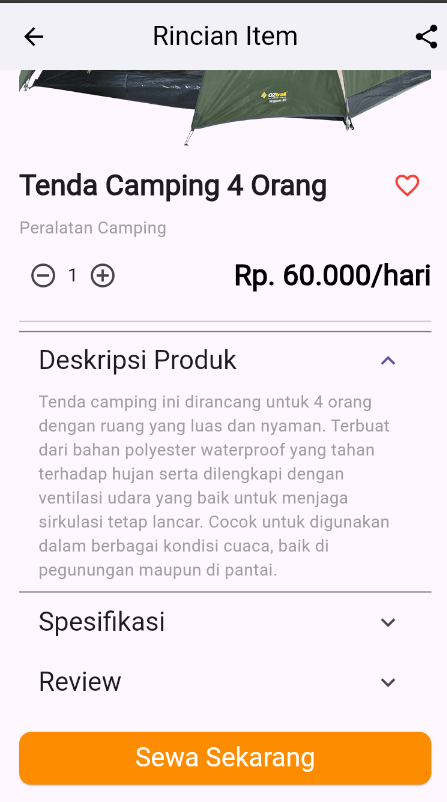
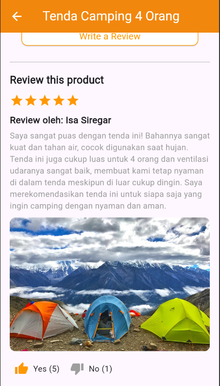
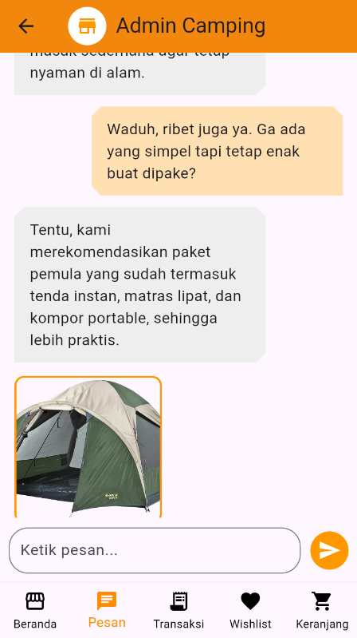
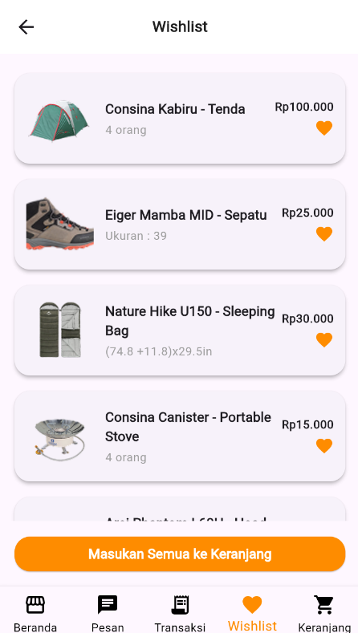
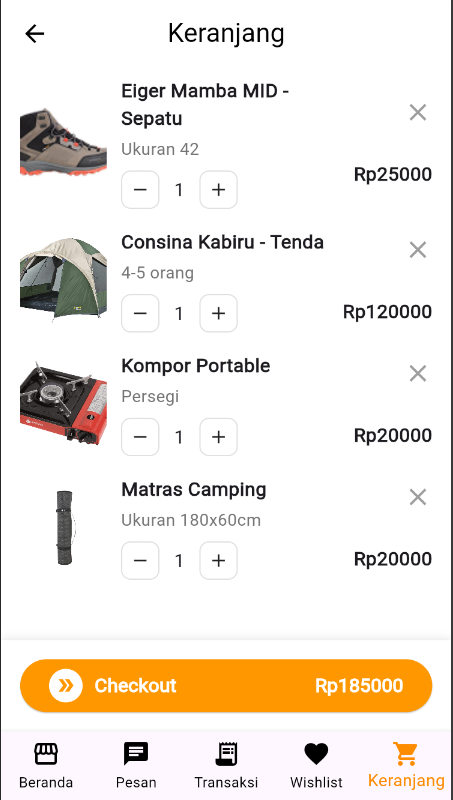
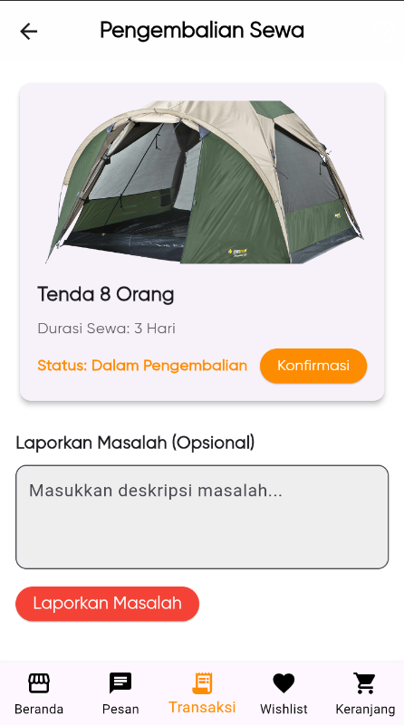

#  Quiz Flutter UI Pemrograman Visual dan Piranti Bergerak
#  Ilmu Komputer - Universitas Pendidikan Indonesia

## 👥 Identitas Kelompok  
**Kelompok 50**  
- Raffi Adzril Alfaiz - 2308355
- Narendra Ridha Baihaqi - 2308882

---

## 📌 Pendahuluan Aplikasi  
Aplikasi ini merupakan proyek quiz untuk menampilkan tampilan antarmuka pengguna (UI) menggunakan **Flutter**.  
Aplikasi ini didesain untuk memudahkan pengguna dalam melakukan aktivitas pemesanan dan penyewaan perlengkapan berkemah.  
Beberapa fitur utama yang disediakan meliputi tampilan halaman depan, detail item, review dan rating penyewa, chat admin, daftar wishlist, checkout keranjang, promosi/paket hemat, serta daftar transaksi.

---

## 🖼️ Dokumentasi Tampilan Aplikasi

### 0. Widget Tree (MAIN)
_.Tampilan awal untuk route ke setiap page._

Berikut dokumentasi berupa screenshot dari fitur-fitur yang telah diimplementasikan:

### 1. 🏠 **Halaman Depan**  
_Tampilan awal aplikasi yang memperkenalkan fitur-fitur utama._

---

### 2. 📄 **Detail Item**  
_Menampilkan informasi lengkap mengenai item yang disewa._

---

### 3. ⭐ **Review dan Rating Item dari Penyewa Sebelumnya**  
_Pengguna dapat melihat ulasan dan penilaian dari penyewa sebelumnya._

---

### 4. 💬 **Chat dengan Admin**  
_Khususnya untuk user pemula yang belum pernah berkemah._

---

### 5. 💖 **Daftar Wishlist**  
_Menyimpan item favorit pengguna._

---

### 6. 🛒 **Keranjang dan Checkout**  
_Menambahkan barang ke keranjang dan proses pembayaran._

---

### 7. 🎁 **Paket Hemat dan Promosi**  
_Tampilan promo menarik untuk pengguna._

---

### 8. 📦 **Daftar Transaksi**  
_Menampilkan status order, proses pengembalian, dan histori pemesanan._

---

### 9. 📦 **Pengembalian Barang**  
_Menampilkan status order, proses pengembalian, dan histori pemesanan._

---

## ➕ Fitur Tambahan Aplikasi

| Fitur                         | Deskripsi                                                                 |
|------------------------------|--------------------------------------------------------------------------|
| ✅ Navigasi (Navbar)         | Navigasi bawah atau atas yang memungkinkan pengguna berpindah antar halaman dengan mudah. |
| 🔀 Routing Page              | Navigasi antar halaman menggunakan sistem routing Flutter.              |
| 🔙 Back Button               | Tombol kembali yang memungkinkan pengguna untuk kembali ke halaman sebelumnya. |
| ➕➖ Increment/Decrement      | Tombol untuk menambah atau mengurangi jumlah item dalam keranjang.       |
| 📊 Slider button              | Checkout menggunakan slider.       |

---
